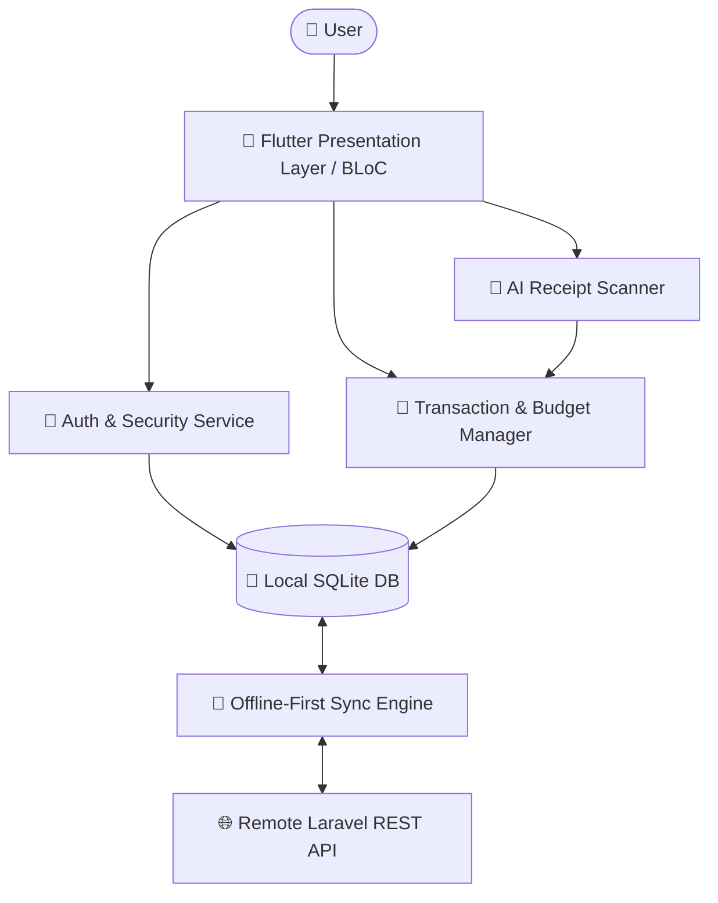
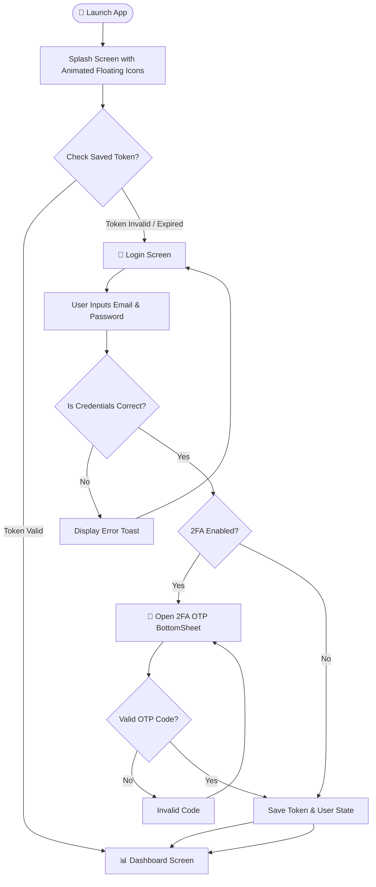
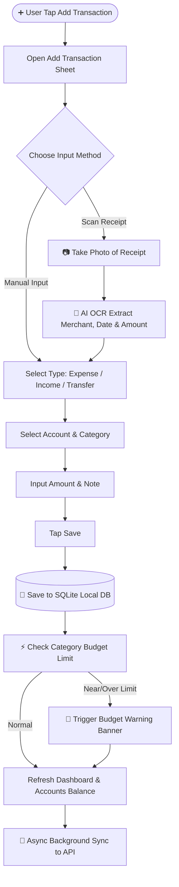

# 💰 Money Management Mobile 2.0 (Premium Financial Platform)


A cutting-edge, futuristic, and feature-packed personal finance tracking application built with Flutter & Dart. Features modern Dark Mode glassmorphism, offline-first synchronization, AI Receipt Scanner, Multi-Currency support, 2FA Security, Savings Goals, Smart Budgeting, and interactive visual charts.

---

## 📱 Screenshots Showcase

<div align="center">

| Splash Screen & Animations | Financial Dashboard | Analytics & Charts |
| :---: | :---: | :---: |
| |  |  |

| Smart Budgets | Savings Goals & Targets |
| :---: | :---: |
|   |  |

</div>

---

## ✨ Key Features & Capability Matrix

### 🔐 1. Authentication & Security (2FA)
- **Email & Password Authentication**: Complete login, register, and token management.
- **Two-Factor Authentication (2FA)**: OTP verification for high-level account security.
- **Biometrics / Pin Lock**: Protection against unauthorized app access.

### 📊 2. Dashboard & Financial Overview
- **Dynamic Balance & Net Worth Display**: Real-time summary of total income, total expenses, and cash flow.
- **Dynamic Floating Particle Animation**: Modern background with interactive elements.
- **Recent Transactions List**: Quick peek into recent expenses with categories and accounts used.

### 💳 3. Multi-Account Management
- **Multiple Wallet Types**: Support for Cash, Bank Accounts (BCA, Mandiri, BRI, etc.), and E-Wallets (GoPay, OVO, Dana).
- **Inter-Account Transfer**: Seamlessly move money between accounts with transaction fee tracking.
- **Multi-Currency**: Convert and view values across IDR, USD, EUR, JPY, SGD, etc.

### 📈 4. Advanced Analytics & Smart Reports
- **Interactive Visual Charts**: Pie charts, line graphs, and category breakdowns.
- **Income vs Expense Analysis**: Weekly, monthly, and yearly breakdown.
- **Category Spending Details**: Track top spending areas automatically.

### 🎯 5. Savings Goals (Tabungan & Impian)
- **Target Tracking**: Set targets for buying gadgets, emergency funds, or vacations.
- **Progress Progress Bars**: Real-time progress percentage calculation with projected finish dates.
- **Contribution History**: Deposit and track savings milestones easily.

### 💡 6. Smart Budgeting System
- **Category Limit Alerts**: Set monthly spending limits per category (e.g. Food, Entertainment).
- **Over-budget Warning System**: Dynamic color indicators (Green -> Yellow -> Red) when nearing limits.

### 🤖 7. AI Receipt Scanner & Automation
- **OCR Receipt Reader**: Scan shopping bills/receipts using camera or gallery to auto-fill transaction forms.
- **Smart Auto-Categorization**: Machine learning auto-detects merchant names and categories.

---

## 🏗️ Architecture & Technology Stack

- **Framework**: Flutter 3.x (Dart 3.x)
- **State Management**: `flutter_bloc` (BLoC Pattern)
- **Local Database**: SQLite (`sqflite`) for Offline-First Data Persistence
- **Networking**: `http` / REST API Backend Synchronization
- **UI Design System**: Dark Glassmorphism, Custom Painters, Canvas Animations, Google Fonts (`Outfit`)

---

## 🔄 System Architecture & Flowchart (Mermaid)

### 1. High-Level System Data Flow



### 2. User Authentication & 2FA Flow



### 3. Transaction Creation & Smart Budgeting Flow



---

## 🚀 Getting Started

### Prerequisites
- Flutter SDK `^3.0.0`
- Dart SDK `^3.0.0`
- Android Studio / VS Code with Flutter Extension

### Installation Steps

1. **Clone the Repository**
   ```bash
   git clone https://github.com/your-username/money-manajemen-mobile.git
   cd money-manajemen-mobile
   ```

2. **Install Dependencies**
   ```bash
   flutter pub get
   ```

3. **Run the Application**
   ```bash
   flutter run
   ```

---

## 📁 Directory Structure

```text
lib/
├── app/                  # Application Theme & Global Constants
├── core/                 # Shared Widgets, Helpers, Database, & Base Utilities
│   ├── database/         # SQLite Helper & Migrations
│   └── widgets/          # Buttons, Cards, Animations, Toasts
├── data/                 # Shared Data Models & Remote/Local Data Sources
└── features/             # Feature Modules (Clean Architecture)
    ├── accounts/         # Wallets & Account Management
    ├── analytics/        # Financial Analytics & Charts
    ├── auth/             # Authentication & 2FA
    ├── budgets/          # Category Budgeting
    ├── dashboard/        # Main Overview & Floating Particle Layout
    ├── profile/          # User Settings & Security
    ├── savings/          # Savings Goals & Milestones
    └── transactions/     # Add, Edit & Filter Transactions
```

---

## 📄 License
This project is licensed under the MIT License - see the `LICENSE` file for details.
